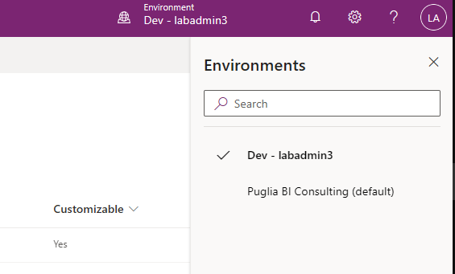

# Lab Prerequisites - Power Apps in a Day

## Download the Materials

1. Download the zip file for Power Apps in a Day from GitHub:
    1. [PAIAD Zip](PAIAD.zip)
2. Extract the Zip File to a new folder at the top level of your C: Drive. The extract folder should be named “PAIAD”.
     1. An example of the content is
         1. C:/PAIAD/Completed for students
         2. C:/PAIAD/PAIAD Lab Sheets
3. . Ensure that there is an excel file named Mchine-Order-Data.xlsx at C:/PAIAD

## Login & Create a Profile in Your Browser

1. Use your favorite browser and create a new profile
2. Bookmark make.powerapps.com in the new profile
3. Based on user, you will sign in to microsoft based on the table provided by trainer
4. Choose from the top right of the power app site environment →
5. Choose Dev - labadmin[YOUR NUMBER] based on user name:

